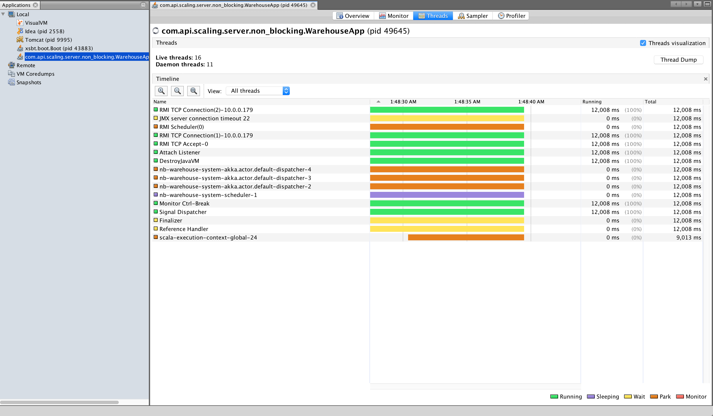
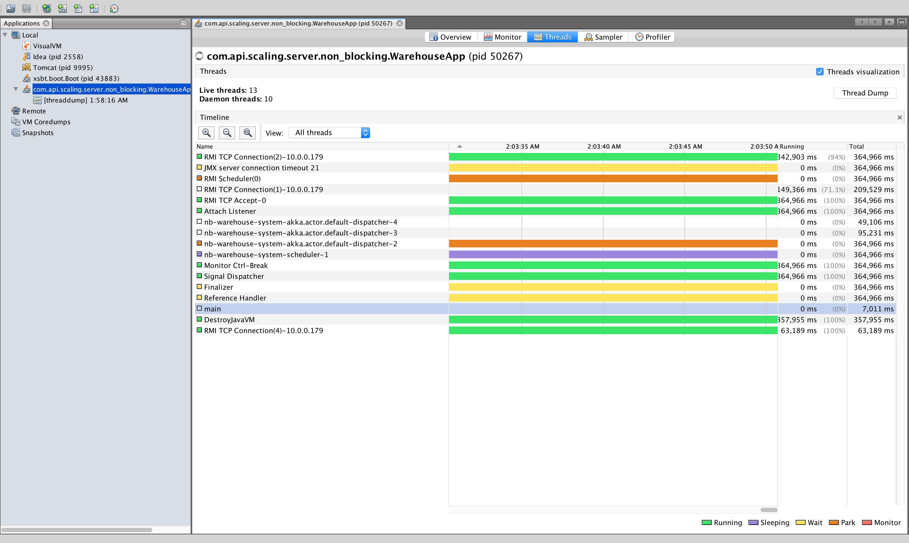

non-blocking
------------




threaddump
--

```
emitting PickupEvent 1
ShipActor received ShipEvent(Lamb of God album - 1)
emitting PickupEvent 2
ShipActor received ShipEvent(Lamb of God album - 2)
emitting PickupEvent 3
ShipActor received ShipEvent(Lamb of God album - 3)
emitting PickupEvent 4
ShipActor received ShipEvent(Lamb of God album - 4)
emitting PickupEvent 5
ShipActor received ShipEvent(Lamb of God album - 5)

```

```

2017-12-19 01:58:16
Full thread dump Java HotSpot(TM) 64-Bit Server VM (25.151-b12 mixed mode):

"DestroyJavaVM" #23 prio=5 os_prio=31 tid=0x00007f84d4c09800 nid=0x1c03 waiting on condition [0x0000000000000000]
   java.lang.Thread.State: RUNNABLE

   Locked ownable synchronizers:
        - None

"RMI TCP Connection(2)-10.0.0.179" #22 daemon prio=9 os_prio=31 tid=0x00007f84d4c3f800 nid=0x6b03 runnable [0x0000700007d57000]
   java.lang.Thread.State: RUNNABLE
        at java.net.SocketInputStream.socketRead0(Native Method)
        at java.net.SocketInputStream.socketRead(SocketInputStream.java:116)
        at java.net.SocketInputStream.read(SocketInputStream.java:171)
        at java.net.SocketInputStream.read(SocketInputStream.java:141)
        at java.io.BufferedInputStream.fill(BufferedInputStream.java:246)
        at java.io.BufferedInputStream.read(BufferedInputStream.java:265)
        - locked <0x00000006c0006398> (a java.io.BufferedInputStream)
        at java.io.FilterInputStream.read(FilterInputStream.java:83)
        at sun.rmi.transport.tcp.TCPTransport.handleMessages(TCPTransport.java:550)
        at sun.rmi.transport.tcp.TCPTransport$ConnectionHandler.run0(TCPTransport.java:826)
        at sun.rmi.transport.tcp.TCPTransport$ConnectionHandler.lambda$run$0(TCPTransport.java:683)
        at sun.rmi.transport.tcp.TCPTransport$ConnectionHandler$$Lambda$159/593113256.run(Unknown Source)
        at java.security.AccessController.doPrivileged(Native Method)
        at sun.rmi.transport.tcp.TCPTransport$ConnectionHandler.run(TCPTransport.java:682)
        at java.util.concurrent.ThreadPoolExecutor.runWorker(ThreadPoolExecutor.java:1149)
        at java.util.concurrent.ThreadPoolExecutor$Worker.run(ThreadPoolExecutor.java:624)
        at java.lang.Thread.run(Thread.java:748)

   Locked ownable synchronizers:
        - <0x00000006c00269c8> (a java.util.concurrent.ThreadPoolExecutor$Worker)

"JMX server connection timeout 21" #21 daemon prio=9 os_prio=31 tid=0x00007f84d4c53800 nid=0x6903 in Object.wait() [0x0000700007c55000]
   java.lang.Thread.State: TIMED_WAITING (on object monitor)
        at java.lang.Object.wait(Native Method)
        - waiting on <0x00000006c00148c8> (a [I)
        at com.sun.jmx.remote.internal.ServerCommunicatorAdmin$Timeout.run(ServerCommunicatorAdmin.java:168)
        - locked <0x00000006c00148c8> (a [I)
        at java.lang.Thread.run(Thread.java:748)

   Locked ownable synchronizers:
        - None

"RMI Scheduler(0)" #20 daemon prio=9 os_prio=31 tid=0x00007f84d1f84000 nid=0x6703 waiting on condition [0x0000700007b52000]
   java.lang.Thread.State: TIMED_WAITING (parking)
        at sun.misc.Unsafe.park(Native Method)
        - parking to wait for  <0x00000006c001c5e8> (a java.util.concurrent.locks.AbstractQueuedSynchronizer$ConditionObject)
        at java.util.concurrent.locks.LockSupport.parkNanos(LockSupport.java:215)
        at java.util.concurrent.locks.AbstractQueuedSynchronizer$ConditionObject.awaitNanos(AbstractQueuedSynchronizer.java:2078)
        at java.util.concurrent.ScheduledThreadPoolExecutor$DelayedWorkQueue.take(ScheduledThreadPoolExecutor.java:1093)
        at java.util.concurrent.ScheduledThreadPoolExecutor$DelayedWorkQueue.take(ScheduledThreadPoolExecutor.java:809)
        at java.util.concurrent.ThreadPoolExecutor.getTask(ThreadPoolExecutor.java:1074)
        at java.util.concurrent.ThreadPoolExecutor.runWorker(ThreadPoolExecutor.java:1134)
        at java.util.concurrent.ThreadPoolExecutor$Worker.run(ThreadPoolExecutor.java:624)
        at java.lang.Thread.run(Thread.java:748)

   Locked ownable synchronizers:
        - None

"RMI TCP Connection(1)-10.0.0.179" #19 daemon prio=9 os_prio=31 tid=0x00007f84d1f82800 nid=0x6503 runnable [0x0000700007a4e000]
   java.lang.Thread.State: RUNNABLE
        at java.net.SocketInputStream.socketRead0(Native Method)
        at java.net.SocketInputStream.socketRead(SocketInputStream.java:116)
        at java.net.SocketInputStream.read(SocketInputStream.java:171)
        at java.net.SocketInputStream.read(SocketInputStream.java:141)
        at java.io.BufferedInputStream.fill(BufferedInputStream.java:246)
        at java.io.BufferedInputStream.read(BufferedInputStream.java:265)
        - locked <0x00000006c0026648> (a java.io.BufferedInputStream)
        at java.io.FilterInputStream.read(FilterInputStream.java:83)
        at sun.rmi.transport.tcp.TCPTransport.handleMessages(TCPTransport.java:550)
        at sun.rmi.transport.tcp.TCPTransport$ConnectionHandler.run0(TCPTransport.java:826)
        at sun.rmi.transport.tcp.TCPTransport$ConnectionHandler.lambda$run$0(TCPTransport.java:683)
        at sun.rmi.transport.tcp.TCPTransport$ConnectionHandler$$Lambda$159/593113256.run(Unknown Source)
        at java.security.AccessController.doPrivileged(Native Method)
        at sun.rmi.transport.tcp.TCPTransport$ConnectionHandler.run(TCPTransport.java:682)
        at java.util.concurrent.ThreadPoolExecutor.runWorker(ThreadPoolExecutor.java:1149)
        at java.util.concurrent.ThreadPoolExecutor$Worker.run(ThreadPoolExecutor.java:624)
        at java.lang.Thread.run(Thread.java:748)

   Locked ownable synchronizers:
        - <0x00000006c0026878> (a java.util.concurrent.ThreadPoolExecutor$Worker)

"RMI TCP Accept-0" #18 daemon prio=9 os_prio=31 tid=0x00007f84d4c26000 nid=0x6303 runnable [0x000070000794c000]
   java.lang.Thread.State: RUNNABLE
        at java.net.PlainSocketImpl.socketAccept(Native Method)
        at java.net.AbstractPlainSocketImpl.accept(AbstractPlainSocketImpl.java:409)
        at java.net.ServerSocket.implAccept(ServerSocket.java:545)
        at java.net.ServerSocket.accept(ServerSocket.java:513)
        at sun.management.jmxremote.LocalRMIServerSocketFactory$1.accept(LocalRMIServerSocketFactory.java:52)
        at sun.rmi.transport.tcp.TCPTransport$AcceptLoop.executeAcceptLoop(TCPTransport.java:400)
        at sun.rmi.transport.tcp.TCPTransport$AcceptLoop.run(TCPTransport.java:372)
        at java.lang.Thread.run(Thread.java:748)

   Locked ownable synchronizers:
        - None

"Attach Listener" #16 daemon prio=9 os_prio=31 tid=0x00007f84d1f7e000 nid=0x6103 waiting on condition [0x0000000000000000]
   java.lang.Thread.State: RUNNABLE

   Locked ownable synchronizers:
        - None

"nb-warehouse-system-akka.actor.default-dispatcher-4" #14 prio=5 os_prio=31 tid=0x00007f84d4bef800 nid=0x5f03 waiting on condition [0x0000700007746000]
   java.lang.Thread.State: TIMED_WAITING (parking)
        at sun.misc.Unsafe.park(Native Method)
        - parking to wait for  <0x00000006c003c558> (a akka.dispatch.ForkJoinExecutorConfigurator$AkkaForkJoinPool)
        at akka.dispatch.forkjoin.ForkJoinPool.idleAwaitWork(ForkJoinPool.java:2135)
        at akka.dispatch.forkjoin.ForkJoinPool.scan(ForkJoinPool.java:2067)
        at akka.dispatch.forkjoin.ForkJoinPool.runWorker(ForkJoinPool.java:1979)
        at akka.dispatch.forkjoin.ForkJoinWorkerThread.run(ForkJoinWorkerThread.java:107)

   Locked ownable synchronizers:
        - None

"nb-warehouse-system-akka.actor.default-dispatcher-3" #13 prio=5 os_prio=31 tid=0x00007f84d2f5c800 nid=0x5d03 waiting on condition [0x0000700007643000]
   java.lang.Thread.State: WAITING (parking)
        at sun.misc.Unsafe.park(Native Method)
        - parking to wait for  <0x00000006c003c558> (a akka.dispatch.ForkJoinExecutorConfigurator$AkkaForkJoinPool)
        at akka.dispatch.forkjoin.ForkJoinPool.scan(ForkJoinPool.java:2075)
        at akka.dispatch.forkjoin.ForkJoinPool.runWorker(ForkJoinPool.java:1979)
        at akka.dispatch.forkjoin.ForkJoinWorkerThread.run(ForkJoinWorkerThread.java:107)

   Locked ownable synchronizers:
        - None

"nb-warehouse-system-akka.actor.default-dispatcher-2" #12 prio=5 os_prio=31 tid=0x00007f84d3d87000 nid=0x5b03 waiting on condition [0x0000700007540000]
   java.lang.Thread.State: WAITING (parking)
        at sun.misc.Unsafe.park(Native Method)
        - parking to wait for  <0x00000006c003c558> (a akka.dispatch.ForkJoinExecutorConfigurator$AkkaForkJoinPool)
        at akka.dispatch.forkjoin.ForkJoinPool.scan(ForkJoinPool.java:2075)
        at akka.dispatch.forkjoin.ForkJoinPool.runWorker(ForkJoinPool.java:1979)
        at akka.dispatch.forkjoin.ForkJoinWorkerThread.run(ForkJoinWorkerThread.java:107)

   Locked ownable synchronizers:
        - None

"nb-warehouse-system-scheduler-1" #11 prio=5 os_prio=31 tid=0x00007f84d4c00000 nid=0x5903 waiting on condition [0x000070000743d000]
   java.lang.Thread.State: TIMED_WAITING (sleeping)
        at java.lang.Thread.sleep(Native Method)
        at akka.actor.LightArrayRevolverScheduler.waitNanos(LightArrayRevolverScheduler.scala:85)
        at akka.actor.LightArrayRevolverScheduler$$anon$4.nextTick(LightArrayRevolverScheduler.scala:265)
        at akka.actor.LightArrayRevolverScheduler$$anon$4.run(LightArrayRevolverScheduler.scala:235)
        at java.lang.Thread.run(Thread.java:748)

   Locked ownable synchronizers:
        - None

"Service Thread" #10 daemon prio=9 os_prio=31 tid=0x00007f84d1814000 nid=0x5503 runnable [0x0000000000000000]
   java.lang.Thread.State: RUNNABLE

   Locked ownable synchronizers:
        - None

"C1 CompilerThread3" #9 daemon prio=9 os_prio=31 tid=0x00007f84d0854800 nid=0x5303 waiting on condition [0x0000000000000000]
   java.lang.Thread.State: RUNNABLE

   Locked ownable synchronizers:
        - None

"C2 CompilerThread2" #8 daemon prio=9 os_prio=31 tid=0x00007f84d0854000 nid=0x5103 waiting on condition [0x0000000000000000]
   java.lang.Thread.State: RUNNABLE

   Locked ownable synchronizers:
        - None

"C2 CompilerThread1" #7 daemon prio=9 os_prio=31 tid=0x00007f84d3003800 nid=0x4f03 waiting on condition [0x0000000000000000]
   java.lang.Thread.State: RUNNABLE

   Locked ownable synchronizers:
        - None

"C2 CompilerThread0" #6 daemon prio=9 os_prio=31 tid=0x00007f84d29de800 nid=0x4d03 waiting on condition [0x0000000000000000]
   java.lang.Thread.State: RUNNABLE

   Locked ownable synchronizers:
        - None

"Monitor Ctrl-Break" #5 daemon prio=5 os_prio=31 tid=0x00007f84d29e9800 nid=0x4b03 runnable [0x0000700006d28000]
   java.lang.Thread.State: RUNNABLE
        at java.net.SocketInputStream.socketRead0(Native Method)
        at java.net.SocketInputStream.socketRead(SocketInputStream.java:116)
        at java.net.SocketInputStream.read(SocketInputStream.java:171)
        at java.net.SocketInputStream.read(SocketInputStream.java:141)
        at sun.nio.cs.StreamDecoder.readBytes(StreamDecoder.java:284)
        at sun.nio.cs.StreamDecoder.implRead(StreamDecoder.java:326)
        at sun.nio.cs.StreamDecoder.read(StreamDecoder.java:178)
        - locked <0x00000006c0043438> (a java.io.InputStreamReader)
        at java.io.InputStreamReader.read(InputStreamReader.java:184)
        at java.io.BufferedReader.fill(BufferedReader.java:161)
        at java.io.BufferedReader.readLine(BufferedReader.java:324)
        - locked <0x00000006c0043438> (a java.io.InputStreamReader)
        at java.io.BufferedReader.readLine(BufferedReader.java:389)
        at com.intellij.rt.execution.application.AppMainV2$1.run(AppMainV2.java:64)

   Locked ownable synchronizers:
        - None

"Signal Dispatcher" #4 daemon prio=9 os_prio=31 tid=0x00007f84d081d000 nid=0x4903 runnable [0x0000000000000000]
   java.lang.Thread.State: RUNNABLE

   Locked ownable synchronizers:
        - None

"Finalizer" #3 daemon prio=8 os_prio=31 tid=0x00007f84d1807000 nid=0x3903 in Object.wait() [0x0000700006b22000]
   java.lang.Thread.State: WAITING (on object monitor)
        at java.lang.Object.wait(Native Method)
        - waiting on <0x00000006c0034db8> (a java.lang.ref.ReferenceQueue$Lock)
        at java.lang.ref.ReferenceQueue.remove(ReferenceQueue.java:143)
        - locked <0x00000006c0034db8> (a java.lang.ref.ReferenceQueue$Lock)
        at java.lang.ref.ReferenceQueue.remove(ReferenceQueue.java:164)
        at java.lang.ref.Finalizer$FinalizerThread.run(Finalizer.java:209)

   Locked ownable synchronizers:
        - None

"Reference Handler" #2 daemon prio=10 os_prio=31 tid=0x00007f84d0811000 nid=0x3703 in Object.wait() [0x0000700006a1f000]
   java.lang.Thread.State: WAITING (on object monitor)
        at java.lang.Object.wait(Native Method)
        - waiting on <0x00000006c0034f88> (a java.lang.ref.Reference$Lock)
        at java.lang.Object.wait(Object.java:502)
        at java.lang.ref.Reference.tryHandlePending(Reference.java:191)
        - locked <0x00000006c0034f88> (a java.lang.ref.Reference$Lock)
        at java.lang.ref.Reference$ReferenceHandler.run(Reference.java:153)

   Locked ownable synchronizers:
        - None

"VM Thread" os_prio=31 tid=0x00007f84d1804800 nid=0x3503 runnable 

"GC task thread#0 (ParallelGC)" os_prio=31 tid=0x00007f84d3800000 nid=0x2503 runnable 

"GC task thread#1 (ParallelGC)" os_prio=31 tid=0x00007f84d3801000 nid=0x2703 runnable 

"GC task thread#2 (ParallelGC)" os_prio=31 tid=0x00007f84d3801800 nid=0x2903 runnable 

"GC task thread#3 (ParallelGC)" os_prio=31 tid=0x00007f84d3802000 nid=0x2b03 runnable 

"GC task thread#4 (ParallelGC)" os_prio=31 tid=0x00007f84d3802800 nid=0x2d03 runnable 

"GC task thread#5 (ParallelGC)" os_prio=31 tid=0x00007f84d3803800 nid=0x2f03 runnable 

"GC task thread#6 (ParallelGC)" os_prio=31 tid=0x00007f84d3804000 nid=0x3103 runnable 

"GC task thread#7 (ParallelGC)" os_prio=31 tid=0x00007f84d3804800 nid=0x3303 runnable 

"VM Periodic Task Thread" os_prio=31 tid=0x00007f84d3831800 nid=0x5703 waiting on condition 

JNI global references: 670


```

after a while
------------

actor threads are gone


